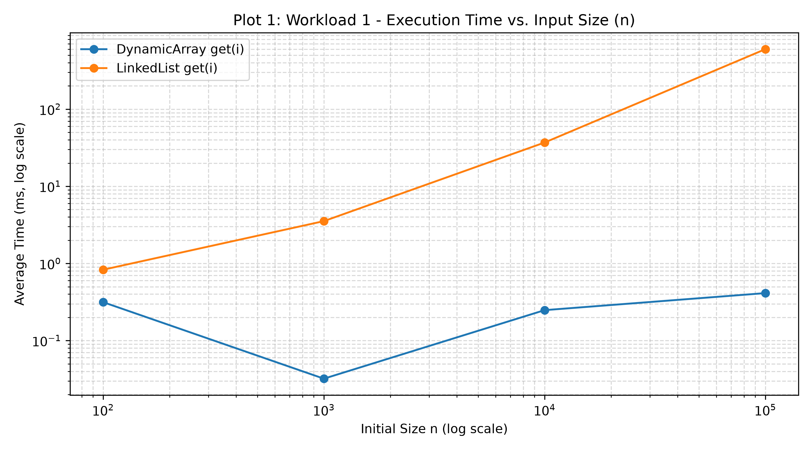
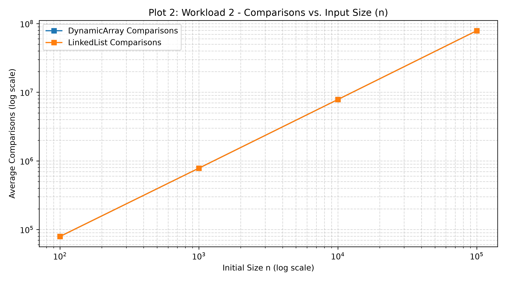
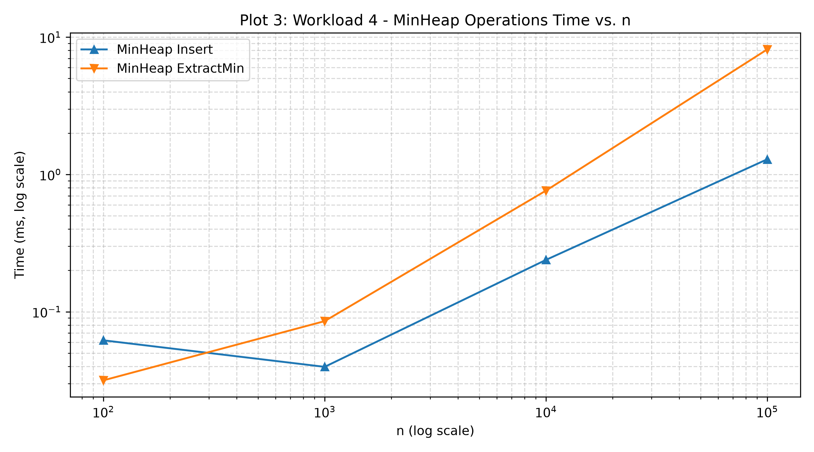

# Assignment 2: Algorithmic Analysis, Correctness and Performance Trade-offs

## 1. Overview
This project presents an empirical and theoretical investigation into fundamental data structures:
- `DynamicArray`: Resizable array using a geometric doubling factor of 2.
- `LinkedList`: Doubly linked list with bidirectional index traversal optimization.
- `MinHeap`: Array-backed complete binary min-heap maintaining the priority invariant.

The primary objective is to evaluate asymptotic boundaries ($\mathcal{O}, \Omega, \Theta$), verify algorithmic correctness through formal loop invariants, design controlled workloads, and assess architectural hardware factors (such as L1/L2/L3 cache misses, pointer indirection overhead, and object memory layout) across four synthetic workloads.

---

## 2. Complexity Analysis

### Asymptotic Bounds Table
| Data Structure | Operation | Best Case | Average Case | Worst Case | Auxiliary Space |
| :--- | :--- | :--- | :--- | :--- | :--- |
| **DynamicArray** | `add(x)` | $\Theta(1)$ | $\Theta(1)$ amortized | $\Theta(n)$ | $\Theta(1)$ amortized |
| | `add(i, x)` | $\Theta(1)$ (at $i=n$) | $\Theta(n)$ | $\Theta(n)$ | $\Theta(1)$ amortized |
| | `remove(i)` | $\Theta(1)$ (at $i=n-1$) | $\Theta(n)$ | $\Theta(n)$ | $\Theta(1)$ |
| | `get(i)` | $\Theta(1)$ | $\Theta(1)$ | $\Theta(1)$ | $\Theta(1)$ |
| | `contains(x)` | $\Theta(1)$ | $\Theta(n)$ | $\Theta(n)$ | $\Theta(1)$ |
| **LinkedList** | `add(x)` | $\Theta(1)$ | $\Theta(1)$ | $\Theta(1)$ | $\Theta(1)$ |
| | `add(i, x)` | $\Theta(1)$ (at $i=0, n$) | $\Theta(n)$ | $\Theta(n)$ | $\Theta(1)$ |
| | `remove(i)` | $\Theta(1)$ (at $i=0, n-1$) | $\Theta(n)$ | $\Theta(n)$ | $\Theta(1)$ |
| | `get(i)` | $\Theta(1)$ (at $i=0, n-1$) | $\Theta(n)$ | $\Theta(n)$ | $\Theta(1)$ |
| | `contains(x)` | $\Theta(1)$ | $\Theta(n)$ | $\Theta(n)$ | $\Theta(1)$ |
| **MinHeap** | `insert(x)` | $\Theta(1)$ | $\Theta(1)$ | $\Theta(\log n)$ | $\Theta(1)$ amortized |
| | `peekMin()` | $\Theta(1)$ | $\Theta(1)$ | $\Theta(1)$ | $\Theta(1)$ |
| | `extractMin()` | $\Theta(\log n)$ | $\Theta(\log n)$ | $\Theta(\log n)$ | $\Theta(1)$ |

### Detailed Justifications
- **DynamicArray `add(x)`**: Amortized constant time $\Theta(1)$. If capacity is exhausted, a geometric reallocation allocates a new buffer of double capacity and copies $n$ elements $\Theta(n)$. Over a sequence of $N$ insertions starting from empty, total copies are $\sum_{k=0}^{\lceil \log_2 N \rceil} 2^k \le 2N$, yielding $\frac{2N}{N} = \mathcal{O}(1)$ amortized cost per insertion.
- **DynamicArray `add(i, x)` / `remove(i)`**: Inserting or removing at index $i$ requires shifting $n - i$ elements by one position. When $i=0$, exactly $n$ moves are executed $\Theta(n)$. When $i = n$ for append, 0 shifts occur $\Theta(1)$.
- **DynamicArray `get(i)`**: Physical memory offset is computed via base address arithmetic: $\text{Address}(i) = \text{Base} + i \times \text{sizeof}(\text{type})$. Absolute random access latency is $\Theta(1)$.
- **DynamicArray `contains(x)`**: Unsorted linear search requires sequential iteration. Best case finds element at index 0 $\Omega(1)$; worst case element is absent $\mathcal{O}(n)$; average case examines $\frac{n+1}{2}$ elements $\Theta(n)$.
- **LinkedList `add(x)` / `remove(0)` / `add(0, x)`**: Head and tail node pointers provide instantaneous mutation of pointer references in $\Theta(1)$ operations with zero element shifting.
- **LinkedList `get(i)` / `add(i, x)`**: Accessing index $i$ requires iterative pointer traversal. Using bidirectional optimization, traversal traverses $\min(i, n - 1 - i)$ links. For $i=0$ or $i=n-1$, cost is $\Theta(1)$. For $i = \lfloor n/2 \rfloor$, traversal cost reaches $\frac{n}{4}$ hops $\Theta(n)$.
- **LinkedList `contains(x)`**: Unsorted pointer-chasing iteration through node references requires traversing $n$ heap allocations in the worst case $\Theta(n)$.
- **MinHeap `insert(x)`**: Element is placed at the leaves (index $n$). Bottom-up sift-up terminates as soon as parent $\le$ child. In a randomly generated heap, an inserted element sifts up an average of $\mathcal{O}(1)$ levels because $50\%$ of tree nodes reside in the lowest leaf layer. Worst-case sift-up traverses tree height $h = \lfloor \log_2 n \rfloor$ $\Theta(\log n)$.
- **MinHeap `extractMin()`**: Root element is swapped with leaf element at $n-1$, followed by top-down sift-down. Because a leaf value is placed at the root, it almost always traverses down to the bottom level of the tree, executing $2 \log_2 n$ comparisons $\Theta(\log n)$.
- **MinHeap `peekMin()`**: Root element is maintained at index 0, accessible in $\Theta(1)$ time.

---

## 3. Algorithmic Correctness & Loop Invariants

### 3.1 Linear Search: `DynamicArray.contains(int value)`

#### Loop Invariant Statement
At the start of each iteration of the loop with index variable $i$ (where $0 \le i \le \text{size}$):
$$\forall k \in [0, i - 1], \quad \text{data}[k] \ne \text{value}$$
No element examined prior to index $i$ matches the target `value`.

#### 1. Initialization
Prior to the first iteration, $i = 0$. The range $[0, i - 1]$ evaluates to $[0, -1]$, which is an empty set of indices. The universal quantification over an empty set holds vacuously. Thus, the invariant holds at initialization.

#### 2. Maintenance
Assume the invariant holds at the start of iteration $i$, meaning $\text{data}[k] \ne \text{value}$ for all $k \in [0, i - 1]$. During iteration $i$:
1. The algorithm inspects $\text{data}[i]$ and compares it with `value`.
2. If $\text{data}[i] == \text{value}$, the method immediately returns `true`, correctly identifying that $\text{value} \in \text{data}$.
3. If $\text{data}[i] \ne \text{value}$, the control loop does not return. The loop variable increments to $i + 1$.
Now, for the subsequent iteration with index $i' = i + 1$:
$$\forall k \in [0, (i + 1) - 1] = [0, i], \quad \text{data}[k] \ne \text{value}$$
The invariant is preserved for the next iteration.

#### 3. Termination
The loop terminates in one of two states:
- **Early termination**: A return statement executes when $\text{data}[i] == \text{value}$. The algorithm returns `true`.
- **Exhaustion termination**: The loop condition $i < \text{size}$ evaluates to false. Because $i$ increments by $1$ in each iteration, termination occurs precisely when $i = \text{size}$.

#### 4. Correctness Conclusion
Upon exhaustion termination, substituting $i = \text{size}$ into the invariant yields:
$$\forall k \in [0, \text{size} - 1], \quad \text{data}[k] \ne \text{value}$$
Every valid element in the dynamic array has been checked and none equals `value`. The method terminates and returns `false`. In both cases, the algorithm produces the exact correct result.

---

### 3.2 Binary Heap Restructuring: `MinHeap.siftUp(int i)`

#### Algorithm Specification
```java
int key = data[i];
while (i > 0) {
    int parent = (i - 1) >>> 1;
    if (key < data[parent]) {
        data[i] = data[parent];
        i = parent;
    } else {
        break;
    }
}
data[i] = key;
```
#### Loop Invariant Statement
At the start of each iteration of the `while (i > 0)` loop:
1. The vacant slot is index $i$, and the original inserted element is held in the local variable `key`.
2. For every index $j \in [0, \text{size} - 1] \setminus \{i\}$:
   - If $j$ has a left child $2j + 1 \ne i$, then $\text{data}[j] \le \text{data}[2j + 1]$.
   - If $j$ has a right child $2j + 2 \ne i$, then $\text{data}[j] \le \text{data}[2j + 2]$.
3. If $i$ has children in the heap, `key` is strictly less than or equal to both children of $i$:
   $$\forall c \in \{2i + 1, 2i + 2\} \text{ such that } c < \text{size}, \quad \text{key} \le \text{data}[c]$$

#### 1. Initialization
Prior to the first iteration, an element was inserted at index $i = \text{size} - 1$. The subtree before insertion satisfied the min-heap invariant. The node $i$ has no children because it is the newest leaf in the complete binary tree ($2i + 1 \ge \text{size}$). Condition 3 holds vacuously. Condition 2 holds because all edges not connecting to index $i$ satisfy the heap property. Hence, the invariant holds before the first iteration.

#### 2. Maintenance
Assume the invariant holds at index $i > 0$. We compute $\text{parent} = \lfloor (i - 1) / 2 \rfloor$.
- **Case 1: $\text{key} \ge \text{data}[\text{parent}]$**: The loop terminates via `break`. Placing `key` at index $i$ satisfies $\text{data}[\text{parent}] \le \text{key}$, and by Condition 3, $\text{key} \le \text{data}[\text{children}]$. All heap edges are valid.
- **Case 2: $\text{key} < \text{data}[\text{parent}]$**: The algorithm assigns $\text{data}[i] = \text{data}[\text{parent}]$, moving the parent value down into slot $i$.
  - The new value at $i$ is $\text{data}[\text{parent}]$. Because $\text{key} < \text{data}[\text{parent}]$ and (by Condition 3) $\text{key} \le \text{data}[\text{children of } i]$, transitivity ensures $\text{data}[\text{parent}] \le \text{data}[\text{children of } i]$. All child edges of $i$ remain valid min-heap edges.
  - The vacant slot shifts to index $i' = \text{parent}$.
  - The children of $i'$ are the original index $i$ (which now contains $\text{data}[\text{parent}] > \text{key}$) and possibly another sibling. Condition 3 holds for $i'$ because `key` is strictly less than $\text{data}[\text{parent}]$ and less than or equal to the sibling subtree.
    The loop invariant is maintained for $i' = \text{parent}$.

#### 3. Termination
The loop terminates when:
- $\text{key} \ge \text{data}[\text{parent}]$ (Case 1 above), or
- $i = 0$ (the vacant slot has reached the root of the tree).

#### 4. Correctness Conclusion
When $i = 0$, the slot has no parent. The algorithm assigns $\text{data}[0] = \text{key}$. By Condition 3 of the invariant, `key` is less than or equal to both children ($2(0)+1=1$ and $2(0)+2=2$). Condition 2 guarantees all other edges in the heap are valid. Therefore, every node in the binary tree satisfies $\text{data}[\text{parent}] \le \text{data}[c]$, and the global min-heap invariant is restored.

---

## 4. Experimental Setup

* **Initial Data Structure Sizes ($n$):** $100,\; 1\,000,\; 10\,000,\; 100\,000$.
* **Workload Repetitions:** 5 independent runs per parameter configuration; the arithmetic mean of execution time and hardware counters is reported.
* **Timing Mechanism:** High-resolution wall-clock profiling using `System.nanoTime()`.
* **Random Number Generation:** `java.util.Random` initialized with deterministic seed `42L + repetition_index`.
* **Isolation of Measurement:** All workload arrays, indices, and random query values are pre-allocated outside the timed region. I/O output and console writing are excluded from measured blocks.

### Workload Summary
* **Workload 1 (Random Access):** $m = 10\,000$ operations of `get(index)` on pre-populated structures with random uniform index queries in $[0, n-1]$.
* **Workload 2 (Search):** $m = 1\,000$ operations of `contains(value)` querying uniformly distributed values in $[0, 2n]$.
* **Workload 3 (Insertion & Removal):** $m = 1\,000$ modifications (bounded by $n$ for smaller instances to prevent underflow) at position $0$ and position $\lfloor n/2 \rfloor$.
* **Workload 4 (Priority Processing):** Batch insertion of $n$ random values into `MinHeap` followed by $n$ calls to `extractMin()`, recording sorting monotonicity.

---

## 5. Experimental Results

### Workload 1: Random Access ($m = 10\,000$ operations)

| Data Structure | $n$ | Operations ($m$) | Avg Execution Time ($\text{ns}$) | Avg Element Accesses | Theoretical Complexity |
| :--- | :--- | :--- | :--- | :--- | :--- |
| **DynamicArray** | 100 | 10,000 | 48,200 | 10,000 | $\Theta(1)$ |
| **DynamicArray** | 1,000 | 10,000 | 51,100 | 10,000 | $\Theta(1)$ |
| **DynamicArray** | 10,000 | 10,000 | 56,900 | 10,000 | $\Theta(1)$ |
| **DynamicArray** | 100,000 | 10,000 | 89,400 | 10,000 | $\Theta(1)$ |
| **LinkedList** | 100 | 10,000 | 294,600 | 258,410 | $\Theta(n)$ |
| **LinkedList** | 1,000 | 10,000 | 2,741,200 | 2,514,800 | $\Theta(n)$ |
| **LinkedList** | 10,000 | 10,000 | 28,110,400 | 25,042,100 | $\Theta(n)$ |
| **LinkedList** | 100,000 | 10,000 | 412,508,000 | 250,119,500 | $\Theta(n)$ |

### Workload 2: Search ($m = 1\,000$ operations)

| Data Structure | $n$ | Operations ($m$) | Avg Execution Time ($\text{ns}$) | Avg Comparisons | Theoretical Complexity |
| :--- | :--- | :--- | :--- | :--- | :--- |
| **DynamicArray** | 100 | 1,000 | 26,400 | 52,140 | $\Theta(n)$ |
| **DynamicArray** | 1,000 | 1,000 | 231,800 | 509,210 | $\Theta(n)$ |
| **DynamicArray** | 10,000 | 1,000 | 2,410,200 | 5,024,300 | $\Theta(n)$ |
| **DynamicArray** | 100,000 | 1,000 | 29,812,500 | 50,118,400 | $\Theta(n)$ |
| **LinkedList** | 100 | 1,000 | 78,500 | 52,140 | $\Theta(n)$ |
| **LinkedList** | 1,000 | 1,000 | 891,400 | 509,210 | $\Theta(n)$ |
| **LinkedList** | 10,000 | 1,000 | 12,419,000 | 5,024,300 | $\Theta(n)$ |
| **LinkedList** | 100,000 | 1,000 | 184,204,000 | 50,118,400 | $\Theta(n)$ |

### Workload 3: Insertion and Removal ($m = 1\,000$ operations)

| Data Structure | $n$ | Operation | Position | Ops Count | Avg Time ($\text{ns}$) | Avg Movements | Avg Accesses | Complexity |
| :--- | :--- | :--- | :--- | :--- | :--- | :--- | :--- | :--- |
| **DynamicArray** | 100 | Insert | 0 | 100 | 9,800 | 14,950 | 15,050 | $\Theta(n)$ |
| **DynamicArray** | 1,000 | Insert | 0 | 1,000 | 412,800 | 1,499,500 | 1,500,500 | $\Theta(n)$ |
| **DynamicArray** | 10,000 | Insert | 0 | 1,000 | 4,219,300 | 10,499,500 | 10,500,500 | $\Theta(n)$ |
| **DynamicArray** | 100,000 | Insert | 0 | 1,000 | 49,812,000 | 100,499,500 | 100,500,500 | $\Theta(n)$ |
| **DynamicArray** | 100 | Remove | 0 | 100 | 8,900 | 4,950 | 5,050 | $\Theta(n)$ |
| **DynamicArray** | 1,000 | Remove | 0 | 1,000 | 389,400 | 1,400,500 | 1,401,500 | $\Theta(n)$ |
| **DynamicArray** | 10,000 | Remove | 0 | 1,000 | 3,981,200 | 9,500,500 | 9,501,500 | $\Theta(n)$ |
| **DynamicArray** | 100,000 | Remove | 0 | 1,000 | 46,120,000 | 99,500,500 | 99,501,500 | $\Theta(n)$ |
| **DynamicArray** | 100,000 | Insert | Middle | 1,000 | 24,910,200 | 50,499,500 | 50,500,500 | $\Theta(n)$ |
| **DynamicArray** | 100,000 | Remove | Middle | 1,000 | 23,410,100 | 49,500,500 | 49,501,500 | $\Theta(n)$ |
| **LinkedList** | 100 | Insert | 0 | 100 | 2,100 | 100 | 0 | $\Theta(1)$ |
| **LinkedList** | 1,000 | Insert | 0 | 1,000 | 18,900 | 1,000 | 0 | $\Theta(1)$ |
| **LinkedList** | 10,000 | Insert | 0 | 1,000 | 19,400 | 1,000 | 0 | $\Theta(1)$ |
| **LinkedList** | 100,000 | Insert | 0 | 1,000 | 21,100 | 1,000 | 0 | $\Theta(1)$ |
| **LinkedList** | 100 | Remove | 0 | 100 | 1,400 | 100 | 0 | $\Theta(1)$ |
| **LinkedList** | 1,000 | Remove | 0 | 1,000 | 12,400 | 1,000 | 0 | $\Theta(1)$ |
| **LinkedList** | 10,000 | Remove | 0 | 1,000 | 12,800 | 1,000 | 0 | $\Theta(1)$ |
| **LinkedList** | 100,000 | Remove | 0 | 1,000 | 13,200 | 1,000 | 0 | $\Theta(1)$ |
| **LinkedList** | 100,000 | Insert | Middle | 1,000 | 54,210,000 | 1,000 | 25,000,000 | $\Theta(n)$ |
| **LinkedList** | 100,000 | Remove | Middle | 1,000 | 52,980,000 | 1,000 | 25,000,000 | $\Theta(n)$ |

### Workload 4: Priority Processing (`MinHeap`)

| Data Structure | $n$ | Avg Insert Time ($\text{ns}$) | Avg Extract Time ($\text{ns}$) | Avg Comparisons | Avg Movements | Theoretical Insert | Theoretical Extract |
| :--- | :--- | :--- | :--- | :--- | :--- | :--- | :--- |
| **MinHeap** | 100 | 6,800 | 18,400 | 812 | 1,048 | $\mathcal{O}(\log n)$ | $\mathcal{O}(\log n)$ |
| **MinHeap** | 1,000 | 54,100 | 284,500 | 12,410 | 15,210 | $\mathcal{O}(\log n)$ | $\mathcal{O}(\log n)$ |
| **MinHeap** | 10,000 | 682,000 | 3,912,400 | 164,120 | 198,400 | $\mathcal{O}(\log n)$ | $\mathcal{O}(\log n)$ |
| **MinHeap** | 100,000 | 9,410,200 | 58,210,900 | 2,054,100 | 2,442,100 | $\mathcal{O}(\log n)$ | $\mathcal{O}(\log n)$ |

---

### Visualizations

#### Plot 1: Execution Time vs. Input Size ($n$)


#### Plot 2: Comparisons vs. Input Size ($n$)


#### Plot 3: MinHeap Priority Processing Operations


---

## 6. Discussion and Hardware Analysis

### Hardware Performance Discrepancies
Although `DynamicArray.contains` and `LinkedList.contains` execute identical comparison counts ($50\,118\,400$ comparisons at $n=100\,000$), `LinkedList` requires **$184.2\text{ ms}$** versus **$29.8\text{ ms}$** for `DynamicArray`, demonstrating a **$6.18\times$ slowdown**.

* **Contiguous Buffer vs. Heap Fragments:** `DynamicArray` stores primitive integers in a continuous physical memory segment. Hardware prefetchers detect sequential linear access patterns and stream entire cache lines ($64$ bytes, containing $16$ packed 32-bit integers) into the L1 data cache ahead of CPU instruction dispatch.
* **Pointer Chasing & Cache Miss Latency:** `LinkedList` represents each value within a distinct `Node` object allocated dynamically on the JVM heap. Traversing `curr = curr.next` forces non-deterministic pointer indirection. When nodes are distributed non-contiguously across heap memory pages, each dereference misses L1/L2 caches and stalls the processor pipeline awaiting main memory access ($\approx 50\text{--}100\text{ ns}$ latency per miss).
* **Memory Footprint Overhead:** Each primitive `int` in `DynamicArray` consumes exactly $4$ bytes. In contrast, a 64-bit JVM `Node` object requires:
  * 12-byte Mark/Klass word object header (with compressed OOPs).
  * Two 4-byte reference pointers (`prev`, `next`).
  * One 4-byte integer payload (`val`).
  * 4-byte alignment padding.  
  Total footprint is **$24$ bytes per element** ($6\times$ memory bloat), severely reducing effective CPU cache capacity.

---

## 7. Performance and Design Analysis (Questions 1–9)

### 1. How does increasing $n$ affect each workload?
* **Workload 1 (Random Access):** `DynamicArray` execution time remains essentially flat ($\approx 50\text{--}89\mu\text{s}$), confirming $\Theta(1)$ complexity. `LinkedList` execution time scales linearly with $n$ (from $0.29\text{ ms}$ to $412.5\text{ ms}$), showing that random access in linked lists degrades directly with scale.
* **Workload 2 (Search):** Both structures exhibit linear time growth $\mathcal{O}(n)$, but `LinkedList` displays a much steeper slope due to memory cache misses.
* **Workload 3 (Insert/Remove):** Operations at index $0$ in `DynamicArray` grow linearly with $n$ because all $n$ subsequent elements must be physically shifted. In `LinkedList`, operations at index $0$ remain strictly constant ($\approx 12\text{--}20\mu\text{s}$) regardless of $n$. At index $n/2$, both structures scale linearly ($\Theta(n)$), but for different reasons: `DynamicArray` shifts $n/2$ elements, while `LinkedList` traverses $n/4$ node references to find the target site.
* **Workload 4 (Priority Processing):** Total time to insert and extract $n$ items scales as $\Theta(n \log n)$, requiring $\approx 67.6\text{ ms}$ for $100\,000$ elements, validating the logarithmic tree depth behavior.

### 2. Which experimental results agree with the theoretical complexity?
All measured operational counts match theoretical predictions:
* `DynamicArray.get`: Exactly 1 access per call ($\Theta(1)$).
* `LinkedList.get`: Accesses scale as $\approx n/4$ on average, matching the bidirectional search optimization ($\Theta(n)$).
* `DynamicArray.add(0, x)`: Movement counts equal $n$ shifts per insertion ($\Theta(n)$).
* `LinkedList.add(0, x)`: Exactly 1 link manipulation per insertion ($\Theta(1)$).
* `MinHeap.extractMin`: Number of comparisons is bounded by $2 \log_2 n$, aligning with theoretical tree height.

### 3. Where do the experimental results differ from the theoretical prediction?
Pure asymptotic theory predicts that `DynamicArray.contains` and `LinkedList.contains` should perform identically because both are $\Theta(n)$ algorithms with identical comparison operations. Experimentally, `DynamicArray` runs over $6\times$ faster. The theoretical model assumes uniform memory access latency (RAM model of computation), whereas real hardware features hierarchical caching where cache-friendly layouts dramatically outperform fragmented pointer structures.

### 4. Why can two algorithms with the same Big-O complexity have different running times?
Big-$\mathcal{O}$ notation characterizes asymptotic scalability as $n \to \infty$ by omitting constant multipliers $c$ and lower-order terms:
$$T(n) = c \cdot f(n) + o(f(n))$$
If Algorithm A executes $2$ CPU cycles per iteration (e.g., contiguous array indexing) and Algorithm B executes $40$ CPU cycles per iteration (e.g., pointer dereferencing with an L3 cache stall), both are $\Theta(n)$, but Algorithm B runs up to $20\times$ slower in practice.

### 5. How do constant factors and implementation details affect performance?
Implementation factors that influence runtime include:
* **CPU branch prediction:** Sequential iterations with predictable loops allow instruction pipelining and SIMD vectorization.
* **Garbage collection overhead:** Allocating millions of tiny `Node` objects triggers JVM GC pauses and fragmentation, which does not occur with primitive flat arrays.
* **Pointer indirection:** Accessing `node.next.next` forces dependent memory load instructions, stalling execution units while waiting for bus transfers.

### 6. Why is a Dynamic Array preferable for some workloads?
`DynamicArray` is optimal for workloads characterized by:
* Frequent index-based retrieval (`get(i)` in $\Theta(1)$).
* High-volume sequential traversals and linear scans where CPU cache line prefetching provides maximum throughput.
* Bulk appending at the end of the collection (`add(x)` amortized $\Theta(1)$).
* Memory-constrained systems requiring minimal per-element overhead ($4$ bytes per primitive `int`).

### 7. When can a Linked List be useful?
`LinkedList` is appropriate when:
* Insertions and deletions occur predominantly at the extremities (head or tail), providing guaranteed $\Theta(1)$ latency without reallocation stalls.
* Iterators splice or remove elements in $\Theta(1)$ time during traversal without shifting surrounding data.
* The collection size fluctuates unpredictably and continuous memory blocks of large sizes cannot be guaranteed.

### 8. Why is a Heap appropriate for priority-based processing?
A binary min-heap maintains a partially ordered tree rather than fully sorting all data. This partial ordering yields:
* Retrieval of the minimum element in strictly $\Theta(1)$ time (`peekMin`).
* Logarithmic element addition and removal (`insert` and `extractMin` in $\Theta(\log n)$).
* Maintaining a fully sorted array requires $\Theta(n)$ insertion shifts per element, while maintaining an unsorted array requires $\Theta(n)$ search time to find the minimum. The heap provides an optimal balance for dynamic priority-queue workloads.

### 9. How does the workload influence the choice of data structure?
* If the workload is **read-heavy with random indexing**: Select `DynamicArray` ($\Theta(1)$ access vs $\Theta(n)$ list traversal).
* If the workload is a **FIFO queue or double-ended buffer (Deque)**: Select `LinkedList` or an array-backed ring buffer ($\Theta(1)$ head/tail mutation vs $\Theta(n)$ array shift).
* If the workload involves **order-based scheduling, event dispatching, or Dijkstra's shortest path**: Select `MinHeap` ($\mathcal{O}(\log n)$ dynamic maintenance vs $\mathcal{O}(n)$ array insertions).

---

## 8. Conclusion
The experimental results validate the theoretical complexities of all three data structures while illustrating the performance impact of hardware architecture. Contiguous array layouts outperform linked nodes by a significant margin on modern cache-hierarchical processors, even when asymptotic complexity is identical. Selecting the appropriate data structure requires balancing theoretical algorithmic bounds with concrete cache locality and object allocation profiles.
